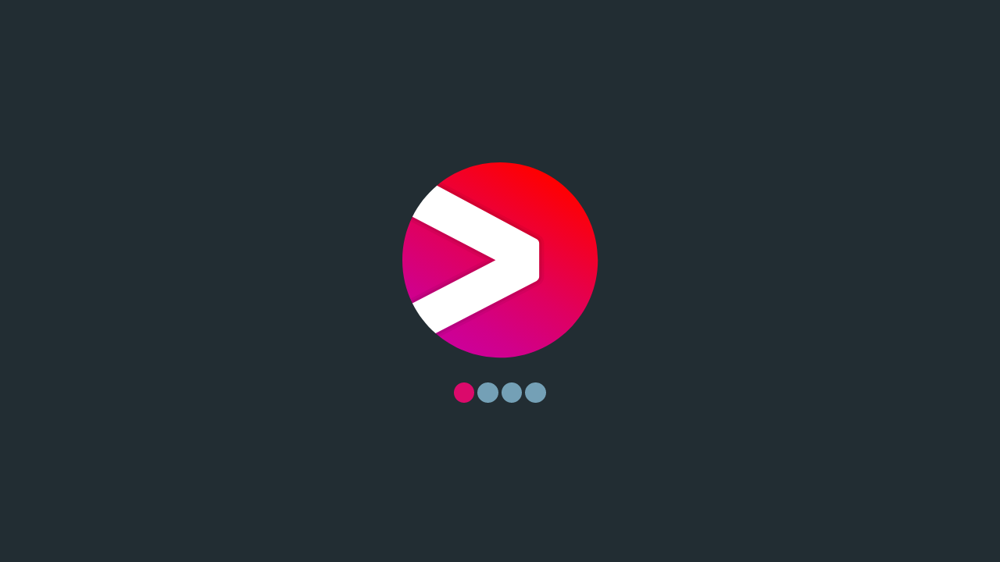
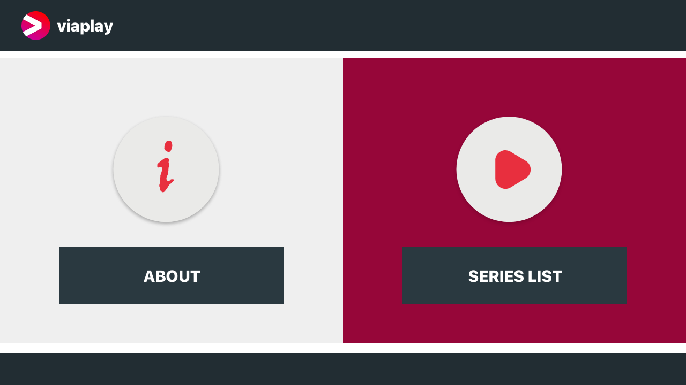
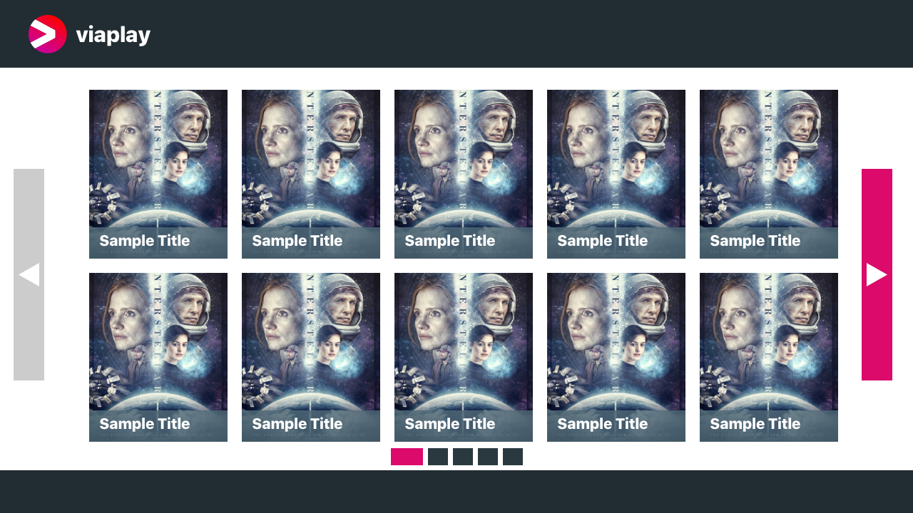
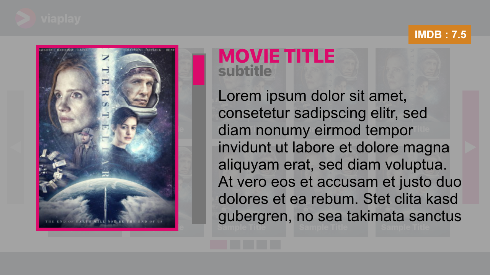

# SERIES LIST SMART TV APPLICATION

#### Available online on:

https://series-list-tv-app.herokuapp.com/

#### Run application : 

`npm run dev `

#### Run tests: 

`npm test`

#### Build production: 

`npm build`

`npm run build-and-start`

#### Run production: 

`npm start`

**Note:** Regarding the release on the Heroku, we should change `npm start` to run serve `dist` .

#### Run auto js documentation generator: 

`npm doc`

**Note:** You should run this to generate the document based on the code comments. 

#### Ready for development/test: 

`npm i`

#### General Info

**Note:** The application design is base on the `1280x720` standard, but by setting `autoScale` to `true` in the `app.js` file, it automatically scaled based on the screen size. (by default, it sets to ‍`false`)

#### Design Decisions

##### Main Design:
When it comes to the main design, I have used the adobe XD to redesign and base the data provider and default ten items per page and posters' main design, I have changed to show items for a better view and user experiences. Add some left and right buttons, breadcrumbs, indicators, etc., to improve UI/UX design.

##### Splash Screen:
In terms of the SmartTV application design and the brand and primary load data simultaneously, we have a splash screen still on screen for seconds.

##### Detail Page:
To show more info about the selected item on the list and use the loaded data more. This section has the potential to develop for many other units.

##### Prevent Regenerate the list:
By checking the generated id and using previous objects, make a real-time view of the loaded item and better performance.

##### Simple About Page:
Having a simple page to introduce the app's main idea or about the company is excellent.

##### Simple Production Build:
With the help of npm and bash script, we have a fast and easy way to minify and make the production version ready to use.

##### Navigation:
Scroll and Navigate with both Mouse and Keyboard; also, we have some LG remote controller support. we are using left, right as up, down function, and mouse wheel up, down and up, down the action to improve user experiences.

#### Local and Remote Data

Inside `service/DataService.js`, we have a variable `_isLocalDebug` that helps you switch offline or online data. When `_isLocalDebug` is `false`, we use a proxy to request the real server without CROS limitation; you should test in this state only on localhost by `npm start` command.

I added some code to set it to `false`, in the build automatically, but currently, it commented on keeping using a local file. You can change it on the `build.sh` file. 

  

#### Bouns Features

* Add detail view by opening items on the list
* Splash screen
* Prevent regenerate the list item on DOM by check if it is generated before
* Add the main page with two simple menu
* Scroll content with both mouse and keyboard
* Add simple about the application
* Use back (ESC) button for details and section and some other LG contorller functions
* Show the guide based on the LG
* Use LG standard control support
* Support both local and remote data by proxy
* Vertical scroll with mouse and keyboard
* Mouse wheel as up and down button
* Add breadcrumbs to list
* Image placeholder
* Images error event to replace with default blank
* Two fixed and scalable view
* Simple production build with minify

#### Design 

Sketch with adobe XD source and export result is available on the `design` directory. I should say,`application.xd` file has some simple micro interaction.

##### Adobe XD

`design/application.xd` 

##### Exported Design

``design/splash.png` 

`desgin/main.png `

`design/list.png`

`design/detail.png`

